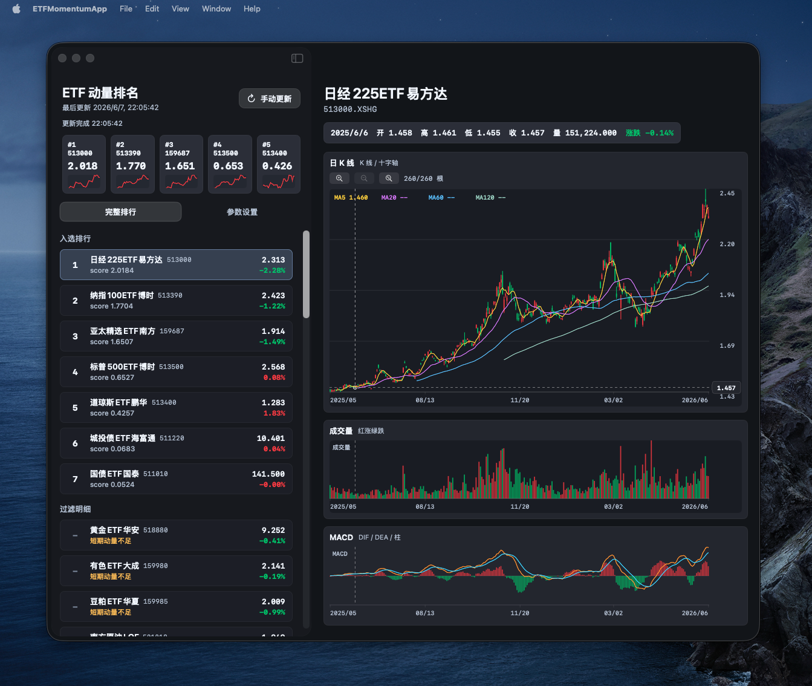
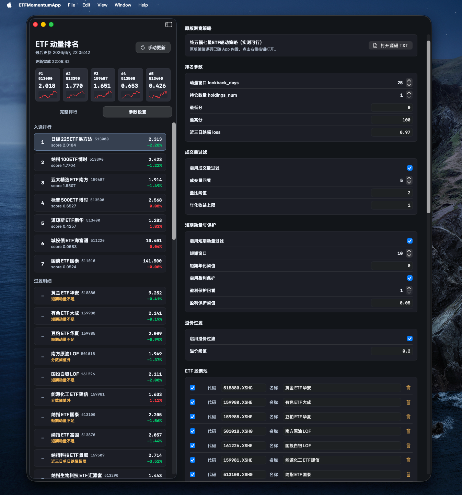

# ETFMomentumWidget

原生 macOS SwiftUI ETF 动量排名工具。主 App 展示完整 ETF 动量排行、参数设置、ETF 股票池编辑、一年日 K、成交量和 MACD；WidgetKit 源码用于展示排名前 5 的 ETF。

颜色遵循 A 股行情习惯：上涨为红色，下跌为绿色。

## 应用截图





## macOS 安装步骤

### 1. 准备环境

本项目是原生 macOS SwiftUI App，需要 macOS 14 或更高版本，并安装 Xcode。

1. 从 Mac App Store 安装 Xcode。
2. 第一次使用 Xcode 后，在终端执行：

```bash
xcode-select --install
sudo xcodebuild -license accept
```

如果已经安装过命令行工具，可以跳过 `xcode-select --install`。

### 2. 下载源码

```bash
cd ~/Downloads
git clone https://github.com/stepven8/ETFMomentumWidget.git
cd ETFMomentumWidget
```

### 3. 构建 App

推荐直接用 Xcode 工程构建：

```bash
xcodebuild \
  -project ETFMomentumWidget.xcodeproj \
  -scheme ETFMomentumApp \
  -configuration Debug \
  -destination 'platform=macOS' \
  build
```

构建成功后，App 通常位于：

```bash
~/Library/Developer/Xcode/DerivedData/ETFMomentumWidget-*/Build/Products/Debug/ETFMomentumApp.app
```

### 4. 安装到“应用程序”

仓库内置了安装脚本，会把构建产物复制到 `/Applications/ETFMomentumApp.app`：

```bash
bash Scripts/install_app.sh
```

也可以手动安装：

```bash
APP_PATH=$(find ~/Library/Developer/Xcode/DerivedData -path '*ETFMomentumWidget*/Build/Products/Debug/ETFMomentumApp.app' -type d | head -1)
rm -rf /Applications/ETFMomentumApp.app
ditto "$APP_PATH" /Applications/ETFMomentumApp.app
xattr -dr com.apple.quarantine /Applications/ETFMomentumApp.app 2>/dev/null || true
open /Applications/ETFMomentumApp.app
```

### 5. 首次打开

如果 macOS 提示来自未识别开发者：

1. 打开“系统设置”。
2. 进入“隐私与安全性”。
3. 在安全提示处点击“仍要打开”。
4. 再次打开 `/Applications/ETFMomentumApp.app`。

### 6. 更新到最新版

```bash
cd ~/Downloads/ETFMomentumWidget
git pull
xcodebuild \
  -project ETFMomentumWidget.xcodeproj \
  -scheme ETFMomentumApp \
  -configuration Debug \
  -destination 'platform=macOS' \
  build
bash Scripts/install_app.sh
```

## 运行

```bash
cd /Users/cai/量化接口文档/ETFMomentumWidget
swift test
swift run ETFMomentumApp
swift run ETFMomentumSmoke
```

默认数据源顺序：

1. Eastmoney 行情与 K 线。
2. Tencent 行情与 K 线 fallback。
3. Eastmoney fundf10 净值，用于溢价率过滤。

可选 AKShare 备选源：

```bash
ETF_MOMENTUM_USE_AKSHARE=1 swift run ETFMomentumSmoke
```

AKShare 是 Python 数据源桥接，脚本为 `Scripts/akshare_provider.py`。如果 AKShare 因当前网络或 Eastmoney 远端断开失败，程序会自动回落到 Tencent fallback，不改变排名公式。

## 动量排名规则

本项目严格复刻源策略 `/Users/cai/量化接口文档/Jq策略/纯五福七星ETF轮动策略（实测可行）.txt` 中以下函数的逻辑：

- `get_ranked_etfs_172`
- `calculate_momentum_metrics_172`
- `get_annualized_returns_172`
- `get_volume_ratio_172`
- `check_profit_protection_172`
- `get_premium_rate_172`

核心实现位于：

- `Sources/ETFMomentumCore/RankingEngine.swift`
- `Sources/ETFMomentumCore/Math.swift`

### 默认参数

默认参数来自源策略 `set_strategy_params(context)`：

| 参数 | 默认值 | 含义 |
|---|---:|---|
| `lookback_days` | `25` | 动量加权回归窗口，最终打分使用最近 `lookback_days + 1` 个价格 |
| `holdings_num` | `1` | 原交易策略持仓数量；本 App 显示完整排行，小组件显示前 5 |
| `defensive_etf` | `511880.XSHG` | 原策略防守 ETF |
| `min_money` | `5000` | 原策略最小交易金额，本 App 保留设置但不下单 |
| `stop_loss` | `0.95` | 原策略止损参数，本 App 保留设置 |
| `loss` | `0.97` | 最近三日单日跌幅过滤阈值 |
| `min_score_threshold` | `0` | 动量分数下限，严格大于才保留 |
| `max_score_threshold` | `100.0` | 动量分数上限，严格小于才保留 |
| `enable_volume_check` | `true` | 是否启用成交量异常过滤 |
| `volume_lookback` | `5` | 日均量回看天数 |
| `volume_threshold` | `2` | 今日分钟成交量 / 近 N 日日均量的量比阈值 |
| `volume_return_limit` | `1` | 量比异常后，年化收益超过该值则过滤 |
| `use_short_momentum_filter` | `true` | 是否启用短期动量过滤 |
| `short_lookback_days` | `10` | 短期动量窗口 |
| `short_momentum_threshold` | `0.0` | 短期年化收益阈值 |
| `enable_profit_protection` | `true` | 是否启用盈利保护过滤 |
| `profit_protection_lookback` | `1` | 盈利保护高点回看日数 |
| `profit_protection_threshold` | `0.05` | 当前价相对高点回撤阈值 |
| `profit_protection_check_times` | `["11:00"]` | 原策略检查时间，本 App 保留设置 |
| `enable_premium_filter` | `true` | 是否启用溢价率过滤 |
| `premium_threshold` | `0.20` | 溢价率阈值，源策略默认为 20% |

### ETF 池

默认 ETF 池来自源策略 `g.etf_pool_3`，包含商品、海外宽基、港股、中概、A 股宽基/风格、固收/现金防御 ETF。实现位于 `Sources/ETFMomentumCore/DefaultETFPool.swift`。

设置页支持启用/禁用、新增、删除和修改 ETF 代码与名称。排行只遍历启用的 ETF，未启用 ETF 在完整排行中显示为“未启用”。

### 完整过滤和打分顺序

排名流程必须按以下顺序执行。顺序不同会导致结果与源策略不一致。

#### 1. 遍历 ETF 池

源策略：

```python
for etf in g.etf_pool_3:
```

本项目按默认股票池顺序逐只计算。只有 `enabled = true` 的 ETF 参与计算。

#### 2. 停牌过滤

源策略：

```python
if current_data[etf].paused:
    continue
```

本项目用行情源最新价判断可交易状态；最新价无效或行情缺失时标记为停牌/计算异常。

#### 3. 取历史数据窗口

源策略：

```python
lookback = max(g.lookback_days, g.short_lookback_days) + 20
prices = attribute_history(etf, lookback, '1d', ['close', 'high'])
if len(prices) < g.lookback_days:
    return None
```

注意：

- 历史数据窗口不是单纯的 `lookback_days`。
- 实际请求长度为 `max(lookback_days, short_lookback_days) + 20`。
- 只要历史数据长度小于 `lookback_days`，该 ETF 直接过滤。

#### 4. 把实时最新价追加到收盘价序列

源策略：

```python
current_price = get_current_data()[etf].last_price
price_series = np.append(prices['close'].values, current_price)
```

这是非常关键的一步。最终短期动量、加权回归打分、最近三日跌幅都使用追加了实时价的 `price_series`，不是只用历史日线收盘价。

#### 5. 盈利保护过滤

源策略：

```python
hist = attribute_history(security, lookback, '1d', ['high'])
max_high = hist['high'].max()
current_price = get_current_data()[security].last_price
return current_price <= max_high * (1 - threshold)
```

若启用 `enable_profit_protection`：

```text
当前价 <= 最近 profit_protection_lookback 日最高价 * (1 - profit_protection_threshold)
```

则过滤该 ETF。

默认参数下，即最近 1 日高点回撤 5% 或以上时过滤。

#### 6. 溢价率过滤

源策略取当前日期往前数第 2 个交易日：

```python
prev_date = get_trade_days(end_date=context.current_dt.date(), count=2)[0]
premium, _, _ = get_premium_rate_172(etf, prev_date)
if premium is not None and premium > g.premium_threshold:
    return None
```

溢价率公式：

```text
premium = (price - net_value) / net_value
```

若：

```text
premium is not None 且 premium > premium_threshold
```

则过滤。

注意：

- 源策略默认阈值是 `0.20`，也就是 20%。
- 若净值缺失，源策略不会过滤；本项目保持一致。
- JoinQuant 的 `unit_net_value` 与公开 API 不完全等价，本项目使用 Eastmoney fundf10/AKShare 净值近似，并在数据源说明中明确标注。

#### 7. 成交量异常过滤

源策略：

```python
hist = attribute_history(security, lookback, '1d', ['volume'])
avg_vol = hist['volume'].mean()
df_vol = get_price(security, start_date=today, end_date=context.current_dt, frequency='1m', fields=['volume'])
current_vol = df_vol['volume'].sum()
ratio = current_vol / avg_vol if avg_vol > 0 else 0
if ratio > threshold:
    return ratio
return None
```

若启用 `enable_volume_check`：

1. 取最近 `volume_lookback` 日成交量均值。
2. 取今日 1 分钟成交量合计。
3. 计算：

```text
ratio = 今日分钟成交量合计 / 最近 volume_lookback 日日均成交量
```

4. 只有 `ratio > volume_threshold` 时，才认为成交量异常。
5. 成交量异常后，再计算当前 `price_series` 的年化收益：

```python
annualized = get_annualized_returns_172(price_series, g.lookback_days)
```

6. 若：

```text
annualized > volume_return_limit
```

则过滤。

注意：成交量没超过阈值时，不会执行这个过滤。

#### 8. 短期动量过滤

源策略：

```python
if len(price_series) >= g.short_lookback_days + 1:
    short_ret = price_series[-1] / price_series[-(g.short_lookback_days + 1)] - 1
    short_ann = (1 + short_ret) ** (250 / g.short_lookback_days) - 1
else:
    short_ann = 0
if g.use_short_momentum_filter and short_ann < g.short_momentum_threshold:
    return None
```

公式：

```text
short_ret = 最新价 / short_lookback_days 前价格 - 1
short_ann = (1 + short_ret) ^ (250 / short_lookback_days) - 1
```

若数据不足，`short_ann = 0`。

若启用短期动量过滤且：

```text
short_ann < short_momentum_threshold
```

则过滤。

默认阈值为 0，即短期年化小于 0 的 ETF 会被过滤。

#### 9. 动量加权回归打分

源策略：

```python
recent_y = np.log(price_series[-(g.lookback_days + 1):])
x = np.arange(len(recent_y))
weights = np.linspace(1, 2, len(recent_y))
slope, intercept = np.polyfit(x, recent_y, 1, w=weights)
ann_ret = math.exp(slope * 250) - 1
ss_res = np.sum(weights * (recent_y - (slope * x + intercept)) ** 2)
ss_tot = np.sum(weights * (recent_y - np.mean(recent_y)) ** 2)
r2 = 1 - ss_res / ss_tot if ss_tot != 0 else 0
score = ann_ret * r2
```

逐项解释：

1. 取最近 `lookback_days + 1` 个价格。
2. 对价格取自然对数：

```text
y = log(price)
```

3. 横轴为从 0 开始的整数序列：

```text
x = 0, 1, 2, ..., lookback_days
```

4. 权重线性递增：

```text
weights = linspace(1, 2, len(y))
```

也就是越新的价格权重越高。

5. 做加权一元线性回归，等价于：

```python
np.polyfit(x, y, 1, w=weights)
```

6. 回归斜率 `slope` 转换成年化收益：

```text
ann_ret = exp(slope * 250) - 1
```

这里 `250` 是源策略使用的年交易日数。

7. 计算加权拟合优度：

```text
fitted = slope * x + intercept
ss_res = sum(weights * (y - fitted)^2)
ss_tot = sum(weights * (y - mean(y))^2)
r2 = 1 - ss_res / ss_tot
```

若 `ss_tot == 0`，则 `r2 = 0`。

8. 最终动量分数：

```text
score = ann_ret * r2
```

含义：

- `ann_ret` 衡量趋势斜率带来的年化收益。
- `r2` 衡量趋势稳定度。
- 只有收益高且趋势拟合稳定，分数才会高。

#### 10. 最近三日单日跌幅过滤

源策略：

```python
if len(price_series) >= 4:
    day1 = price_series[-1] / price_series[-2]
    day2 = price_series[-2] / price_series[-3]
    day3 = price_series[-3] / price_series[-4]
    if min(day1, day2, day3) < g.loss:
        return None
```

这里比较的是“价格比值”，不是涨跌幅百分比。

默认 `loss = 0.97`，含义是最近三段价格变化里，只要任意一段跌幅超过 3%，即：

```text
min(day1, day2, day3) < 0.97
```

就过滤。

注意：`day1` 使用“实时最新价 / 前一日收盘价”。

#### 11. 分数阈值过滤

源策略：

```python
if metrics and (g.min_score_threshold < metrics['score'] < g.max_score_threshold):
    etf_metrics.append(metrics)
```

这是严格不等号：

```text
min_score_threshold < score < max_score_threshold
```

因此：

- `score == min_score_threshold` 不入选。
- `score == max_score_threshold` 不入选。

默认下限是 0，所以分数必须严格大于 0。

#### 12. 排序

源策略：

```python
etf_metrics.sort(key=lambda x: x['score'], reverse=True)
```

最终只按 `score` 降序排序，不额外按年化收益、短期动量、成交量、代码等字段二次排序。

小组件显示排序后的前 5；完整排行页显示所有 ETF 的计算状态和过滤原因。

## 一致性检验

测试位于 `Tests/ETFMomentumCoreTests/RankingParityTests.swift`。

当前覆盖：

- 加权回归结果与确定性样本一致。
- `ann_ret`、`r2`、`score` 浮点误差小于 `1e-10`。
- 过滤顺序覆盖短期动量、溢价、最近三日跌幅。
- 分数阈值使用严格不等号。
- 最终排序按 `score` 降序。

Python oracle 位于 `Scripts/python_oracle.py`，直接使用 `numpy.polyfit(..., w=weights)` 复刻源策略公式。

运行：

```bash
swift test
python3 Scripts/python_oracle.py
```

## Widget 说明

`Sources/ETFMomentumWidgetExtension/WidgetView.swift` 是 WidgetKit 源码。Swift Package 可以编译源码，但真正安装为 macOS 桌面小组件需要 Xcode App target + Widget Extension target 生成 `.app` 和 `.appex`。

当前主 App 可通过 SwiftPM 运行和安装到 `/Applications`，Widget 源码已准备好挂入 Xcode target。
